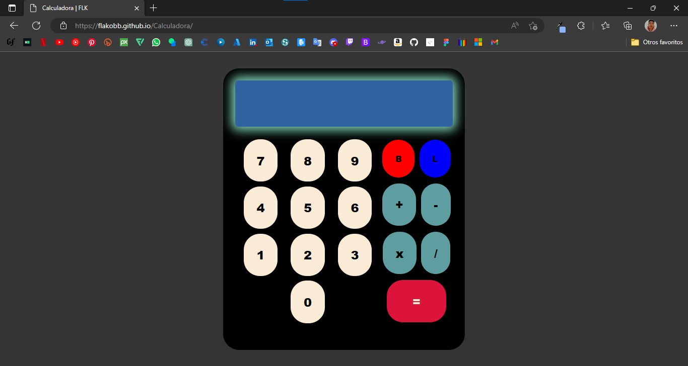

# **Calculadora**

[Despliegue de la aplicacion](https://flakobb.github.io/Calculadora/)

Calculadora de operaciones basicas con JavaScript

Esta calculadora permite al usuario ingresar una operacion precionando los botones en pantalla

Al presionar el boton de igual, la aplicación guarda la operacion como una cadena y despues separa los numeros con respecto al operador ingresado.

Los numeros se guardan como cadenas en un arreglo, para despues ser convertidos a numeros enteros.

Se identifica el operador ingresado y a traves de un Switch se realiza la operacion indicada y se muestra el resultado en pantalla.

**Nota:** Solamente hace operaciones con dos numeros. Hasta ahora...